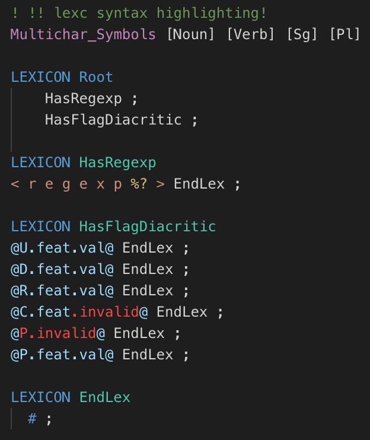

# lexc README

Provides syntax highlighting for the `lexc` Lexicon Compiler language, used by `xfst`, HFST, and Foma to define finite-state transducers.

## Features

## Release Notes

### 1.0.2
Make it explicit that this is MIT licensed

### 1.0.1

Minor tweaks for publication

### 1.0.0

Initial release of `.lexc` syntax highlighting.

## License

Copyright © 2019 National Research Council Canada.

Licensed under the MIT license.
